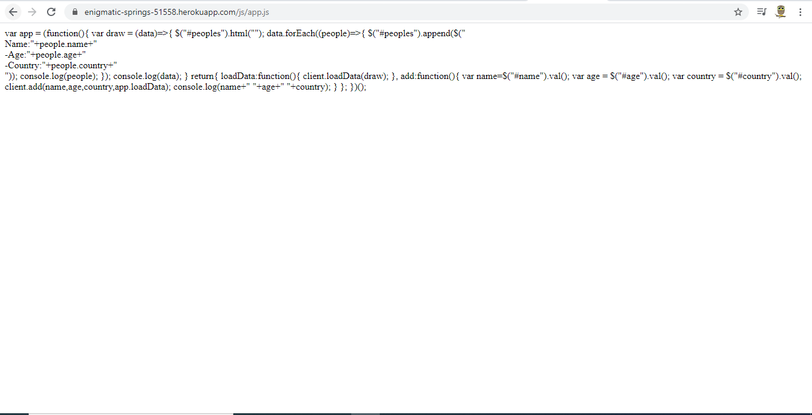
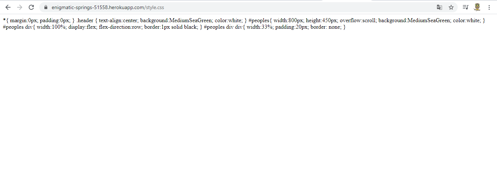
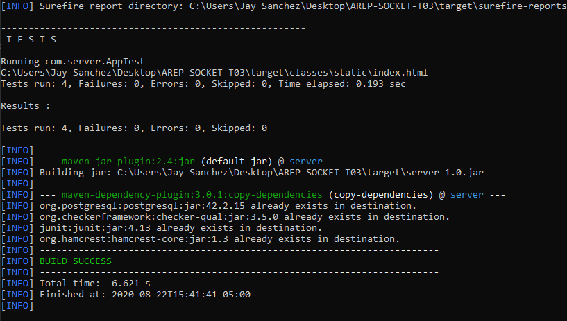

# AREP-SOCKET-T03  Modificacion a spring

### Presentado por: 

Jeisson Geovanny Sanchez Ramos

Para este trabajo se decidio reutilizar el metodo get ya creado y simplemente hacemos que el metodo get llame al metodo correspondiente al bean. 

### Link de heroku

MicroSpring

[ver](https://floating-everglades-57412.herokuapp.com/)

Spark

[ver](https://enigmatic-springs-51558.herokuapp.com/)

### Documento Arquitectura

[ver](AREP_T_03.pdf)

### JavaDoc

[ver](javadoc)

### Aplicacion 

La aplicacion utliza una implementacion propia de un servidor de archivos.

La aplicacion reconoce el path root / como index.html

[root](https://enigmatic-springs-51558.herokuapp.com/)

[index](https://enigmatic-springs-51558.herokuapp.com/index.html)

La aplicacion cuenta con los siguientes archivos estaticos

- index.html
- porter2.PNG
- styles.css
- js/app.js
- js/client.js

Con funciones get cuenta con las siguientes

- /peoples devuelve una lista de personas a manera de json
- /addPeople esta recibe parametros name, age y country

La funcion addPeople es con motivos practicos ya que esta peticion realmente deberia corresponder a people con el metodo post.

### Ejecutar

~~~
    mvn exec:java -Dexec.mainClass=com.app.App
~~~

### Prueba contenido estatico

Al pedir el directorio root del sitio deberia cargar el index.html

Al pedir /js/app.js deberia mostrar el javascript

[ver](https://enigmatic-springs-51558.herokuapp.com/js/app.js)

Al pedir /style.css deberia mostrar la hoja de estilos.

[ver](https://enigmatic-springs-51558.herokuapp.com/style.css)

Al pedir /porter2.PNG deberia mostrar la imagen

 

[ver](https://enigmatic-springs-51558.herokuapp.com/porter2.PNG)

### Pruebas

~~~
    mvn test
~~~

### Referencias

[Imagenes socket](https://stackoverflow.com/questions/25086868/how-to-send-images-through-sockets-in-java)

[headers para imagenes](https://stackoverflow.com/questions/14728125/how-do-i-send-an-image-over-http-protocol-in-c)

